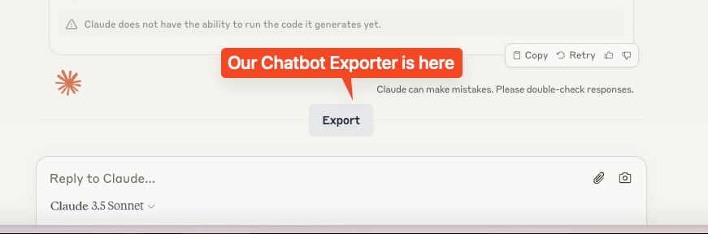
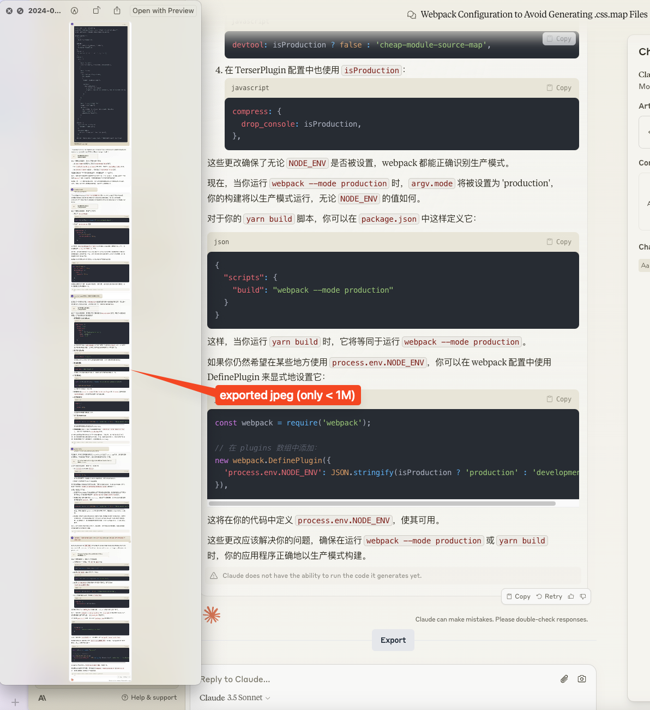

  
  <h1>Chatbot Exporter</h1>
  <blockquote>Share your favorite chat messages in 1 second. </blockquote>

## Usage

1. **download**: visit [Releases Page](https://github.com/cs-magic/exts_chrome_chatbot-exporter/releases) and download the latest / stable `chatbot-exporter_....zip` file
2. **install**: visit Chrome Extensions Page (chrome://extensions), enable the development mode, and load the unpacked extension
3. **run**: visit any chatbot website of the following:
    - [x] https://claude.ai
    - [x] https://chatgpt.com
    - [ ] https://poe.com
    - [ ] https://monica.im
    - [ ] https://doubao.com
    - [ ] ... (please issue if you have chatbot website to be supported)
4. **use**:
   1. you should be able to find the **Export** button just on top of the input area, like:

     

   2. click the `Export` button, you would have a file downloaded into your local `Downloads` folder.

     

## Motivation

We always want to share our chat conservation to others.

But the official way is not user-friendly.

Many of us fallback to use the scroll technology.

Now, with **Chatbot Exporter**, you can natively have an export button just in the above of input area, 
providing you with a magic experience.

Enjoy it!

## Release

### v0.1.0_beta.2_2024-09-19

- [x] fixed: theme switch

### v0.1.0_beta.1_2024-09-19

- [x] feat: download with history together
- [x] feat: added CICD for release
- [x] fixed: naming problem
- [x] fixed: image quality problem (scale)
- [x] fixed: claude image dirty transition (after adding backgroundColor)
- [x] improvement: png --> jpeg, for smaller file size

### v0.1.0_beta.0_2024-09-19

- [x] init

## Todo

- [ ] feat: Claude with graph
- [ ] feat: other chatbots, e.g. POE
- [ ] fix: ChatGPT UI deficit
- [ ] engineering: CICD with yarn build