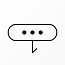
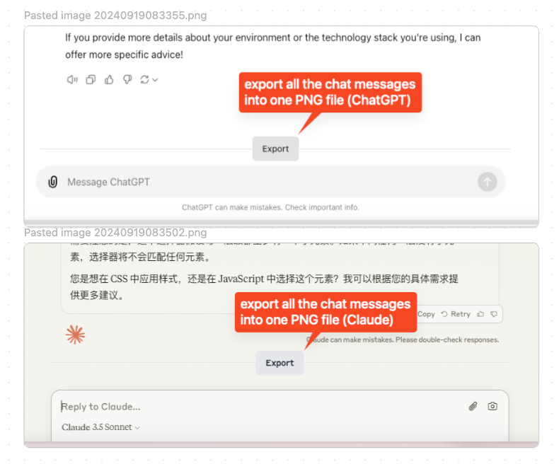

# Chatbot Exporter

## Effect

## Motivation

We always want to share our chat conversion to others.

But the official way is not user-friendly.

Many of us fallback to use the scroll technology.

Now, with **Chatbot Exporter**, you can natively have an export button just in the above of input area, 
providing you with a magic experience.

Enjoy it!

## Todo

- [ ]: Claude with graph
- [ ]: fix ChatGPT UI deficit
- [ ]: POE / ... (other chatbot like products)
- [x]: feat: download with history together
